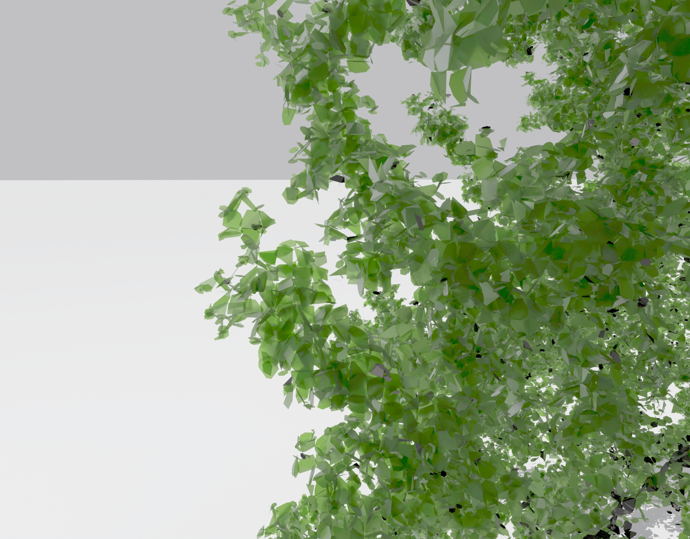

# dotshadow

How to cite:

Frey J, Schindler Z, McClatchy P, Morhart C, Larysch E, Seifert T (2025) The 3D reconstruction of wood and leaves from terrestrial laser scanning – a case study on PAR measurements below a solitary Malus domestica tree. Silva Fennica 59. https://doi.org/10.14214/sf.24027

This R script takes a point cloud of vegetation from terrestrial laser scanning as input and computes polygons representing the leaves and woody components. This is a helpful tool to generate input data for radiative transfer models. Therefore, the point cloud is split into voxel cells, and for every cell, an optimal fitting plane is calculated based on the points in the voxel. The points get projected to the plane, and a convex hull is fit to the planar set of points. The convex hull is buffered to the theoretical distance between two points on a plane due to the downsampling distance of the point cloud to avoid gaps between the polygons.

Within the data folder you can find an example point cloud and PAR sensor data recorded by a sensor network below the tree for validation. 

The development of the software was funded by the Deutsche Forschungsgemeinschaft (DFG, German Research Foundation) – Project FR 4404/1-1, “Making the direct link between light regime and forest biodiversity – a 3D spatially explicit modelling approach based on TLS, CNNs and ray tracing”.

