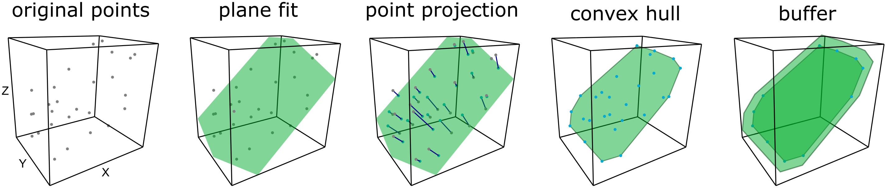

# dotshadow

This R script takes a point cloud of vegetation from terrestrial laser scanning as input and computes polygons representing the leaves and woody components. This is a helpful tool to generate input data for radiative transfer models. Therefore, the point cloud is split into voxel cells, and for every cell, an optimal fitting plane is calculated based on the points in the voxel. The points get projected to the plane, and a convex hull is fit to the planar set of points. The convex hull is buffered to the theoretical distance between two points on a plane due to the downsampling distance of the point cloud to avoid gaps between the polygons.

How to cite:
